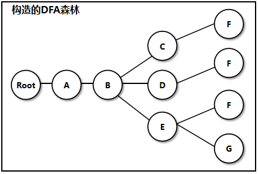

# DFA
DFA有限状态机的敏感词过滤算法
对于一个游戏，如果有聊天功能，那么我们就会希望我们的聊天系统能够对玩家的输入进行判断，如果玩家的输入中含有一些敏感词汇，那么我们就禁止玩家发送聊天，或者把敏感词转换为 * 来替换。

#### 一 DFA 算法的优点

设已经有了一个敏感词词库，那么最容易想到的过滤敏感词的方法就是：遍历整个敏感词库，拿到敏感词，再判断玩家输入的字符串中是否有该敏感词，如果有就把敏感词字符替换为 *，但这样的方法，需要遍历整个敏感词库，并且对玩家输入的字符串进行替换。而整个敏感词库中一般会有上千个字符串。而玩家聊天输入的字符串一般也就 20~30 个字符。因此，这种方法的效率是非常低的，无法应用到真实的开发中。
而使用 DFA 算法就可以实现高效的敏感词过滤。使用 DFA 算法，只需要遍历一遍玩家输入的字符串即可将所有存在的敏感词进行替换。

#### DFA 算法原理

DFA 算法是通过提前构造出一个 树状查找结构(实际上应该说是一个 森林)，之后根据输入在该树状结构中就可以进行非常高效的查找。
设敏感词库的词汇为：ABC ABD ABE ABCF ABDF ABEF ABEG  

  

假设输入了HIABCFJ 遍历得H I A B C F J
若使用数组或者列表指向敏感字符串的指针,则每次都需要遍历,所以这里使用哈希表来存储敏感词开头字符,此哈希表存放着一系列Key为不同敏感词开头字符,Value为该字符节点的键值对,还可以存放一个Key为isEnd,Value为0的键值对,Value为0代表当前节点不为结构的末尾,Value为1表示该节点为结构末尾

#### 构建DFA森林

创建一个哈希表，作为该结构的空白根节点
遍历敏感词词库，得到一个敏感词字符串
遍历敏感词字符串，得到一个当前遍历字符
在树结构中查找是否已经包含了当前遍历字符，如果包含则直接走到树结构中已经存在的这个节点，然后继续向下遍历字符。
DFA查找过程:
对于敏感词的第一个字符串而言：
indexMap = map // 相当于指向树结构节点的指针
if(indexMap.ContainsKey(‘c’)) indexMap = indexMap[‘c’]
indexMap 相当于一个指针，就指向了树结构中已经存在了的相同节点
对于后面的字符也是同样的：
if(indexMap.ContainsKye(‘c’)) indexMap = indexMap[‘c’]
如果树结构中不存在，或者是当前指针指向的节点，其所有子节点都没有表示当遍历到的字符，则我们就需要创建一个子节点，即添加一个键值对，其 Key 为当前遍历到的字符， Value 为新建一个哈希表。
判断当前遍历的字符，是否是当前字符串的最后一个。如果是 则添加键值对 Key 为 “IsEnd” Value 为 1。 如果不是，则添加键值对 Key 为 “IsEnd” Value 为 0。

#### DFA 算法结构初始化构造的代码
```csharp
private Hashtable map;
private void InitFilter(List<string> words) {
    map = new Hashtable(words.Count);
    for (int i = 0; i < words.Count; i++) {
        string word = words[i];
        Hashtable indexMap = map;
        for (int j = 0; j < word.Length; j++) {
            char c = word[j];
            if (indexMap.ContainsKey(c)) {
                indexMap = (Hashtable)indexMap[c];
            } else {
                Hashtable newMap = new Hashtable();
                newMap.Add("IsEnd", 0);
                indexMap.Add(c, newMap);
                indexMap = newMap;
            }
            if (j == word.Length - 1) {
                if (indexMap.ContainsKey("IsEnd")) indexMap["IsEnd"] = 1;
                else indexMap.Add("IsEnd", 1);
            }
        }
    }
}
```
#### DFA 算法查找过程的代码实现
```csharp
private int CheckFilterWord(string txt, int beginIndex) {
    bool flag = false;
    int len = 0;
    Hashtable curMap = map;
    for (int i = beginIndex; i < txt.Length; i++) {
        char c = txt[i];
        Hashtable temp = (Hashtable)curMap[c];
        if (temp != null) {
            if ((int)temp["IsEnd"] == 1) flag = true;
            else curMap = temp;
            len++;
        }
        else break;
    }
    if (!flag) len = 0;
    return len;
}
public string SerachFilterWordAndReplace(string txt) {
    int i = 0;
    StringBuilder sb = new StringBuilder(txt);
    while (i < txt.Length) {
        int len = CheckFilterWord(txt, i);
        if (len > 0) {
            for (int j = 0; j < len; j++) {
                sb[i + j] = '*';
            }
            i += len;
        }
        else ++i;
    }
    return sb.ToString();
}
```
